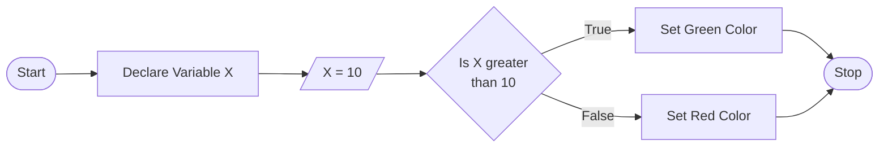

<Toc :columns="2" />

---
layout: image-left
image: /terminology-header.png
class: text-center effect_Shadow mt-25 text-10
transition: fade-out 
---

# Overview

<!---->

📚 Terminology

🖼️ P5JS sketch

🖥️ openProcessing

---
layout: fact
---

# Terminology
Why terminology matters?

---
layout: quote
---

# "Whenever the speech is corrupted so is the mind"

- Lucius Annaeus Seneca

<v-click>

Speech is made of words, and the words have meaning. These are grouped together to form thoughts or ideas and to move them from one person to another. If you can corrupt the speech, by banning words or concepts, everything else is corrupted as well.
</v-click>

---
image: /computer.webp
layout: image
transition: fade-out
class: text-right text-8
---

# Computers

Runs instructions by humans

Power supply
  
Processor 
  
Memory (RAM)
  
Hard drive (Harddisk)
  
Video Card (GPU)
  
Preipherals (IO, Keyboard, mouse)

---
layout: center

---

# Programming
\> _ <
<v-click>

Programming is the process of creating a set of instructions that tell a computer how to perform a task.
</v-click>

<v-click>

Instructions are made up of written codes.
</v-click>

Codes  are written according to a specific Programming Language.

<!--<v-click>

The purpose of programming is solving a given <kbd>problem</kbd>.
</v-click>-->

---
layout: center
---

# Programming Language

A system of notation (syntax) used communicate with computers and tell them what to do.

<!-- A programming language may consists of specific words, functions, and operators. -->

---
layout: center
---

# Types of Programming Language

Textual Programming Languages 

E.g. Javascript, C++, Python...

Graphical Programming Languages (a.k.a Node-based)

E.g Scratch

Mixed-Programming Languages 

E.g TouchDesigner, MAX

---
image: /p5js.webp
layout: image-left
transition: fade-out
---

# P5JS Overview

A dedicated creative coding framework/library for artists & designers.

Main Elements;
- 🧪 Javascript
- 🖼️ Canvas 
- ⚙️ Functions
- 📦 Libraries
- 🔗 [P5JS Website](https://p5js.org)

---
layout: image-right
image: /p5js2.png
class: text-left 
transition: fade-out
---
# OpenProcessing

P5JS Programming interface

Features;
- Text Editor
- Online IDE (Integrated Development Environment)
- 🔗 [OpenProcessing Editor](https://openprocessing.org)

 

 Artist: Ilja Borisovs
 

---
layout: image
image: ./week02_ss1.png
preload: false
---

  <Arrow x1="700" y1="230" x2="850" y2="25" color="green" width="4" />

---
src: ./pages/break.md
hide: false
---

---
layout: image
image: ./week02_ss2.png
preload: false
---

  <Arrow x1="700" y1="230" x2="856" y2="25" color="green" width="4" />

---
layout: image
image: ./week02_ss3.png
preload: false
---

  <Arrow x1="700" y1="230" x2="856" y2="25" color="green" width="4" />

---
layout: image
image: ./week02_ss4.png
preload: false
---

  <Arrow x1="700" y1="230" x2="510" y2="10" color="#ffcc00" width="4" />
  
View the code

---
layout: image
image: ./week02_ss5.png
preload: false
---

  <Arrow x1="840" y1="230" x2="840" y2="18" color="#ff0000" width="4" />
  
Change Layout

---
layout: image
image: ./week02_ss6.png
preload: false
---

  <Arrow x1="825" y1="230" x2="825" y2="10" color="#ff0000" width="4" />
  
Share Your Sketch

---
layout: image
image: ./week02_ss7.png
preload: false
---

  <Arrow x1="230" y1="48" x2="795" y2="48" color="#ff0000" width="4" />
  
Download Your Sketch

---
layout: image
image: ./week02_ss8.png
preload: false
class: pt-150
---

  <Arrow mt--150 x1="400" y1="240" x2="400" y2="40" color="#ff0000" width="4" />
  
Copy the sketch link

---
layout: center
image: /imageH.jpg
class: text-center
transition: fade-out
---
# Submit the Link & your sketch to LMS

---
layout: center
image: /imageH.jpg
class: text-center 
transition: fade-out
---
# Diagrams in Programming

  

<!-- http://mermaid.js.org/syntax/flowchart.html -->

---
layout: center
---
# Cartesian Coordinate System

- Horizontal Axis X starts from 0
- Vertical Axis Y starts from 0
- To move objects to right ➡️ & left ⬅️, increase-decrease the X value
- To move objects to down ⬇️ & up ⬆️, increase-decrease the Y value

---
layout: full
---

<Youtube id="85O_4DmYB9g?si=iRABiv6BcQ-VlFDY&t=152" width="100%" height="100%"/>

---
layout: two-cols
class: p-5
---

<Tweet id="1663656442065309698" />

::right::

<Tweet id="1577636022128558081" />

---
layout: two-cols
class: text-left
hide: true
---

# Exhibtion & Events

[Grand Pera - Eskizden Piksele](https://www.instagram.com/p/CxxsIiIo-dn/)

[David Szauder](https://www.instagram.com/alptugan/saved/creative-coding/17989090882163487/?img_index=1)

---
layout: two-cols
class: text-left
hide: true
---

# Learn More

[P5JS Video Tutorial Series](https://thecodingtrain.com/tracks/code-programming-with-p5-js/code/0-trailer/trailer)

<Tweet id="1686015782277251074" />

::right::
<Tweet  id="1427649830491496448" />

[Neil Mendoza](https://www.instagram.com/p/CGF0b-zFGAX/)

---
layout: center
class: text-center
hide: true
---

# Sources

[Other Presentations](https://github.com/alptugan/Slidev_Presentations) · [alptugan](https://www.alptugan.com) · [RandomSeed](https://randomseed.cargo.site)

---
src: ./pages/assignment.md
hide: false
---