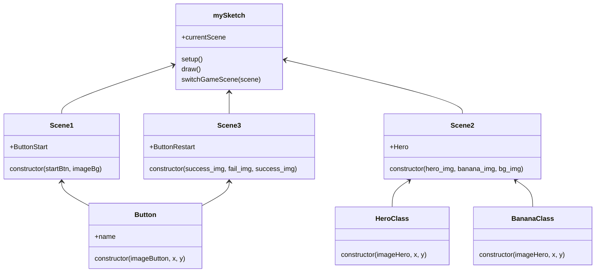

---
layout: default
---
# Table of Contents

<Toc :columns="2" />


---
layout: center
---
# Game Scenes

<div class='grid grid-cols-4 gap-4'>
<div>

<div text-center>Game Start</div>
</div>

<div>

<div text-center>Game Play</div>
</div>

<div>

<div text-center>Game End (FAIL)</div>
</div>

<div>

<div text-center>Game End (SUCCESS)</div>
</div>
</div>

---
layout: section
---
# Computational Thinking Framework
## The method for Problem-Solving
### 1. Decomposition
### 2. Translation
### 3. Algorithm Design

---
layout: default
---
# 1. Decomposition
Note down everything you see on your interface design formally. You don't need to determine the relation between objects in the design. For instance;
1. There three scenes namely scene1, scene2, and scene3. 
2. Each scene has a background scene. Export background images within the same resolution of your canvas.
3. Scene1 and Scene3 have button. Each button has its own image. Export button images.
4. Scene2 includes two text fields for displaying the score and remaining time.
5. Scene2 has the hero and falling items. Export these images individually.

---
layout: default
---

# 2. Translation
Translate the notes to the p5JS language. E.g:
1. It is better to create a class for each individual scene. Refer to class creation [reference](https://openprocessing.org/sketch/2182799).
2. Each scene includes an image. So create a variable to load and display the image. Check the *scene1* tab, *line 4* [reference](https://openprocessing.org/sketch/2191906)
3. Include another variable for Scene1 and Scene3. Check the tabs *scene1*, *scene3* and *Button* tab for button creation [reference](https://openprocessing.org/sketch/2191906)
4. Check the *scene2* tab, lines *106-118* in the [reference](https://openprocessing.org/sketch/2191906). 
5. Check the *HeroClass* and *BananaClass* inside *scene2* tab in the [reference](https://openprocessing.org/sketch/2191906) game.

---
layout: default
---
# 3. Algorithm Design
Create the logic according to your story. Edit the relevant class files or create a new one, if your game play scene (scene2) is different than the reference game. 


---
layout: center
---
# Game Scenes

<div class='grid grid-cols-4 gap-4'>
<div>

<div text-center>Game Start</div>
</div>

<div>

<div text-center>Game Play</div>
</div>

<div>

<div text-center>Game End (FAIL)</div>
</div>

<div>

<div text-center>Game End (SUCCESS)</div>
</div>
</div>


---
layout: left
---
# Decomposition of the mySketch

```js {1-6|8-15|17-23|25-29|all}{lines:true, startLine: 1, maxHeight:'100%'}
// -----------------------------------------------------
// SCENE1 Properties
// -----------------------------------------------------
let s1; 																// Scene1 Class variable
let s1_Game_Bg = "start_bg.jpg";				// Background image of the scene1
let s1_StartBtn_Src = "btn_start.png";	// Start Button image of the scene1

// -----------------------------------------------------
// SCENE2 Properties
// -----------------------------------------------------
let s2; 																// Scene 2 Class variable
let s2_GameBg_Src = "bg.jpg";						// Background image of the scene1
let s2_Hero_Src = "monkey.gif";					// Hero image for the HeroClass
let s2_Banana_Src = "banana.png";				// Banana image for the BananaClass
let s2_GameTime = 30;										// Game Time

// -----------------------------------------------------
// SCENE3 Properties
// -----------------------------------------------------
let s3; // Scene 3
let s3_Fail_Bg = "bg_fail.jpg";						// Background image of the scene3 -> fail
let s3_Success_Bg = "bg_success.png";			// Background image of the scene3 -> success
let s3_ReStartBtn_Src = "btn_restart.png";// Restart Button image of the scene3

// -----------------------------------------------------
// Global Game Variables
// -----------------------------------------------------
let currentScene = 1;										// Variable stores the current game scene 1=Scene1, 2=Scene2, 3=Scene3 
let totalScore = 0;											// Variable stores the current score


```

---
layout: default
class: text-left m-0
---

# Algorithm Design (Game Architecture)



<!--
    Button .. functions
    HeroClass .. functions
    BananaClass .. functions
    Scene1 .. functions
    Scene2 .. functions
    Scene3 .. functions
    -->


---
src: ./pages/break.md
hide: false
---


---
layout: section
class: text-center text-yellow 
---

# *"First, solve the problem.*
# *Then, write the code."*
<div pt-10 text-gray>John Johnson</div>


---
src: ./pages/assignment.md
hide: false
---